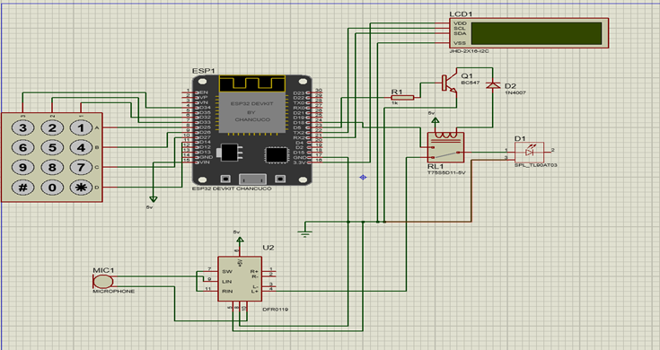
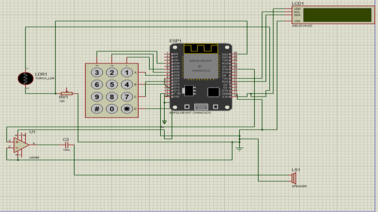
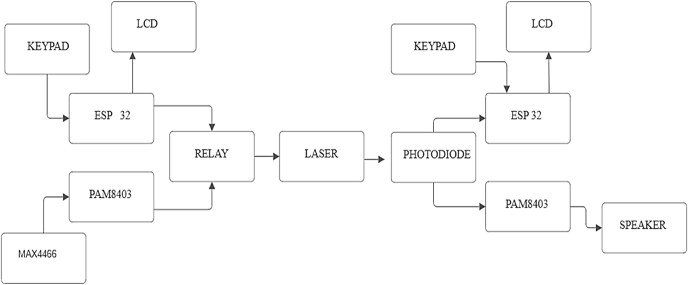

<h1 align="center">🔴 Li-Fi Based Underwater Wireless Text Communication System</h1>

  
  
  
  

  <strong>A secure, ESP32-based underwater text communication system using Li-Fi, laser light, and custom encoding.</strong>

<h2>📋 Project Overview</h2>

This project demonstrates a secure, ESP32-based <strong>underwater wireless communication system using Li-Fi (Light Fidelity)</strong>.
Laser light is used to transmit text messages underwater, with a custom binary encoding mechanism for message reliability and lightweight performance.

<ul>
  <li>🔒 Secure and password-protected</li>
  <li>💡 Custom text-to-binary protocol</li>
  <li>🔴 Laser diode + photodiode for physical layer</li>
  <li>🧠 Fully hardware-based (no PC required)</li>
</ul>

<h2>🧠 System Architecture</h2>

<ul>
  <li><strong>🔼 Transmitter:</strong> ESP32 + Laser Diode + Keypad + LCD + Relay</li>
  <li><strong>🔽 Receiver:</strong> ESP32 + LDR/Photodiode + Keypad + LCD</li>
  <li><strong>🔁 Flow:</strong> Text ➝ Custom Binary Encoding ➝ Laser Pulses ➝ Photodiode ➝ Decoding ➝ Display</li>
  <li><strong>🔐 Security:</strong> Receiver requires password to unlock and view the message</li>
</ul>

<h2>📂 Repository Contents</h2>

<ul>
  <li><code>1_Transmitter.c</code> – Main ESP32 code for the transmitter</li>
  <li><code>2_Receiver.c</code> – Main ESP32 code for the receiver</li>
  <li><code>1.1_TXcircuit.png</code> – Transmitter circuit schematic</li>
  <li><code>2.1_RXcircuit.png</code> – Receiver circuit schematic</li>
  <li><code>3_BlockDiagram.png</code> – System block diagram</li>
</ul>

<h2>🔧 Hardware Components</h2>

<ul>
  <li>ESP32 DevKit V1 (x2)</li>
  <li>Laser Diode & Photodiode (LDR)</li>
  <li>4x4 Matrix Keypad</li>
  <li>16x2 LCD Display (I2C)</li>
  <li>Relay Module</li>
  <li>Breadboard, Jumper Wires, Resistors</li>
</ul>

<h2>🔐 Features</h2>

<ul>
  <li>✅ Custom binary encoding protocol</li>
  <li>✅ Receiver-side password authentication</li>
  <li>✅ Real-time LCD interaction</li>
  <li>✅ Secure & isolated text communication</li>
  <li>✅ No PC/serial monitor required</li>
  <li>✅ Tested under simulated underwater conditions</li>
</ul>

<h2>📸 Demo Setup</h2>

  
  
  

<h2>🚀 Getting Started</h2>

<ol>
  <li>🔌 Connect components as per circuit diagrams</li>
  <li>📥 Upload <code>1_Transmitter.c</code> to the transmitter ESP32</li>
  <li>📥 Upload <code>2_Receiver.c</code> to the receiver ESP32</li>
  <li>🔋 Power both systems and enter password on the receiver after transmission</li>
</ol>

<h2>🧾 License</h2>

This project is for academic and personal research purposes only. Commercial usage is prohibited without prior permission from the author.

<h2>✍️ Author</h2>

  <strong>Harshal Pachange</strong> 
  Electronics & Telecommunication Engineering – SPPU 
  Embedded Systems | Laser Communication | Security Systems

